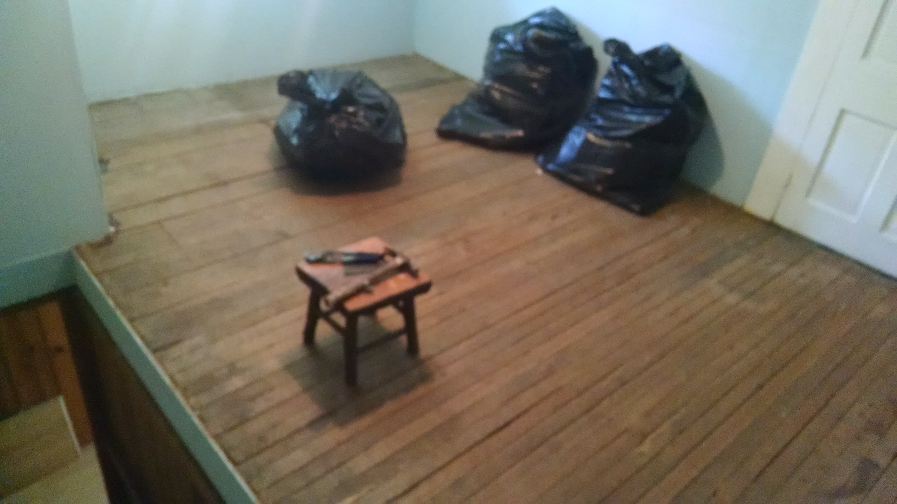

TL;DR: This is not a major announcement of any kind. Nothing is really changing (aside from the fact that **my available development time is about to skyrocket** ). Vocal and Birdie 2.0 are still in development and will be released before long. This is just a personal update about where I've been, what I'm doing right now, and what I plan to do.

## Where I've Been
For the past month or so, nearly all of my time has been focused on finishing my senior-level Computer Science courses. The various class projects that I have been working on took much more of my time than I expected, so I did not get much of a chance to work on Vocal or Birdie, and simply elementary had to take a little bit of time off as well.

## Operation: Renovation
I haven't graduated yet (I still have a couple general education courses I need to complete), but I am beginning to transition to my post-university life. As of last Thursday, I am no longer a full-time college student.

This obviously means a lot of things in my life will be changing, but perhaps the biggest immediate change is that I am moving into a new house! Woohoo! The only problem is that this house was built in 1937 and is in dire need of lots of renovations. So, for the next week or so, I'm basically Bob Vila. I'm moving furniture, tearing stuff down, sanding floors, painting walls, doing electrical work, and all other kinds of crazy reno stuff. I'll be working from sun up to sun down, taking breaks only to sleep and eat.

I'm most looking forward to finally having my own office! This is what it looks like right now (sorry for the blurry pic):

I'll upload photos later to show what it looks list post-reno.

## Birdie and Vocal 2.0
Once my new office/workspace is up and running, development of both Vocal and Birdie will be in full-swing. I'd like to have both 2.0 releases available by the time that elementary OS Loki is in beta, but I don't know if that's actually possible. I will DEFINITELY have both available by the time the Loki stable release comes around.

## simply elementary
simply elementary, the podcast I co-host with Dane Henson, will be starting back next week(ish). I have to talk with him to confirm a recording date, and hopefully line up a guest.

## Upcoming Projects
Throughout the remainder of 2015, I will be working on:
### Indie Development
* Starting Vocal 3.0 (with library and episode syncing)
* Delivering multiple point releases of Birdie (2.x)
* Working more on first-party elementary development
* If I have time, a third app that I've had on my mind for years. This will probably happen more in 2017

### "Real" Work
* Working full-time throughout the summer, and part time in the fall, at my primary job helping manage a 1:1 MacBook Deployment in a K-12 school system
* Working an additional part-time job doing web development and backend work for a medium-sized company over the summer

That's basically it! Just wanted to let you all know why I disappeared for a bit, and tell you know that I'm (almost) back.
